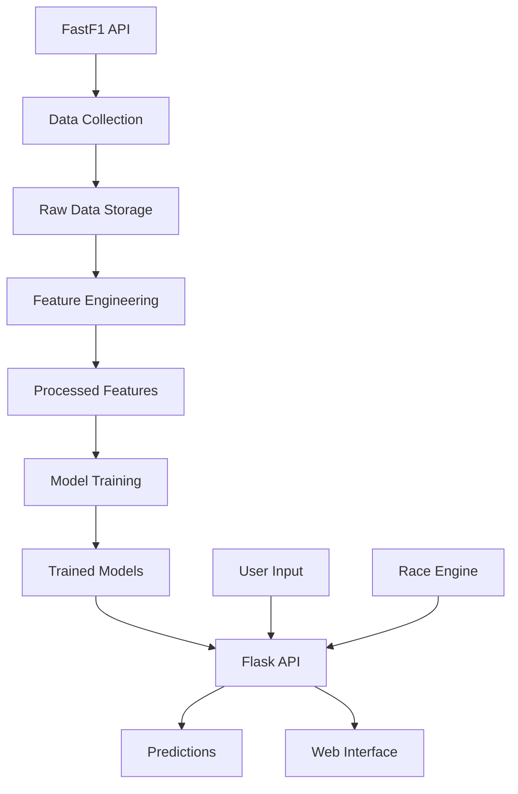

## System Overview

The Formula 1 ML Prediction System is a comprehensive race prediction platform that combines historical race data, machine learning models, and real-time simulation to predict race outcomes with high accuracy.

<CardGroup cols={2}>
  <Card title="85.9% Accuracy" icon="chart-line">
    Achieved through ensemble learning and feature engineering
  </Card>
  <Card title="Real-time Simulation" icon="gauge-high">
    Lap-by-lap race engine with pit stops and safety cars
  </Card>
  <Card title="Weather-Aware" icon="cloud-rain">
    Adapts predictions based on weather conditions
  </Card>
  <Card title="20+ Features" icon="sliders">
    Driver, team, circuit, weather, and tire strategy features
  </Card>
</CardGroup>

## Architecture Components

The system consists of five main components that work together to deliver accurate race predictions:

### 1. Data Collection Layer

**File:** `collect_working.py`

Collects historical F1 data using the FastF1 API:

- Race results (positions, points, grid positions)
- Driver and team information
- Event metadata (year, round, event name)
- Multiple seasons (2023-2024)

```python
session = fastf1.get_session(year, round_num, 'R')
session.load()
results = session.results
```

### 2. Feature Engineering Pipeline

**Files:** `feature_engineering.py`, `feature_engineering_v2.py`

Transforms raw data into ML-ready features:

<Tabs>
  <Tab title="Driver Features">
    - Average position (historical)
    - Average points per race
    - Total wins and podiums
    - DNF rate
    - Circuit-specific performance
  </Tab>
  <Tab title="Team Features">
    - Team average position
    - Team total wins
    - Recent form (last 5 races)
  </Tab>
  <Tab title="Weather Features">
    - Weather conditions (DRY, LIGHT_RAIN, HEAVY_RAIN)
    - Weather impact multiplier
    - Is wet race flag
  </Tab>
  <Tab title="Tire Features">
    - Tire compound (SOFT, MEDIUM, HARD)
    - Tire degradation rate
    - Optimal pit lap
    - Tire advantage score
  </Tab>
</Tabs>

### 3. ML Model Layer

**Files:** `winner_predictor.py`, `train_model_v2.py`

Two ensemble models working together:

<CardGroup cols={2}>
  <Card title="Random Forest" icon="tree">
    - 150 estimators
    - Max depth: 12
    - Min samples split: 8
    - Primary prediction model
  </Card>
  <Card title="XGBoost" icon="rocket">
    - 100 estimators
    - Max depth: 6
    - Learning rate: 0.1
    - Gradient boosting ensemble
  </Card>
</CardGroup>

### 4. Race Simulation Engine

**File:** `race_engine.py`

Lap-by-lap race simulator with realistic physics:

```python
RACE_LAPS = 50
PIT_LOSS = 22.0  # seconds

TIRE_DEG = {
    "SOFT":   0.085,  # seconds per lap
    "MEDIUM": 0.050,
    "HARD":   0.028
}
```

Features:
- Real lap times with tire degradation
- Pit stop strategy (undercut/overcut)
- Safety car periods
- Weather changes mid-race
- DNFs and mechanical failures
- Driver skill ratings and team performance

### 5. Web Application

**File:** `app.py`

Flask-based web interface with multiple features:

- Winner prediction with probabilities
- Weather impact analysis
- Tire strategy optimizer
- Feature importance visualization
- Driver head-to-head comparison
- Full race simulation
- 2026 season prediction
- Lap-by-lap race viewer

## Data Flow Architecture



<Note>
The system uses **time-based data splitting** to prevent data leakage. Training uses only historical data that occurred before the test races.
</Note>

## Component Interaction

### Prediction Flow

1. **User Input** → Grid position, weather, tire, circuit type
2. **Feature Creation** → Convert inputs to feature vector
3. **Model Ensemble** → RF and XGBoost predict independently
4. **Probability Averaging** → Average predictions for final result
5. **Response** → Return probability and insights

### Simulation Flow

1. **Setup** → Initialize 20 drivers with skill ratings
2. **Qualifying** → Determine starting grid based on driver/team performance
3. **Strategy Assignment** → Assign tire strategies based on weather
4. **Lap Loop** → Simulate 50 laps with:
   - Tire degradation
   - Pit stops
   - Safety cars
   - Weather changes
   - DNF events
5. **Results** → Generate final standings and statistics

## Technology Stack

<Accordion title="Backend & ML">
- **Python 3.8+**: Core language
- **FastF1**: F1 data API
- **scikit-learn**: Random Forest classifier
- **XGBoost**: Gradient boosting
- **pandas**: Data manipulation
- **numpy**: Numerical computing
- **Flask**: Web framework
- **joblib**: Model serialization
</Accordion>

<Accordion title="Frontend">
- **HTML/CSS/JavaScript**: UI
- **Plotly.js**: Interactive charts
- **Custom CSS**: Responsive design
</Accordion>

<Accordion title="Data Storage">
- **CSV files**: Raw and processed data
- **JSON**: Model outputs and predictions
- **Pickle files**: Serialized ML models
</Accordion>

## Model Files

The system maintains two model versions:

**V1 Models** (Basic):
- `winner_predictor_rf.pkl` - Random Forest
- `winner_predictor_xgb.pkl` - XGBoost
- `feature_columns.pkl` - Feature list

**V2 Models** (Enhanced):
- `winner_predictor_v2.pkl` - Enhanced RF with weather/tire features
- `feature_columns_v2.pkl` - Extended feature list

<Note>
The app automatically falls back to V1 models if V2 is unavailable (see app.py:10-20).
</Note>

## Performance Characteristics

- **Training Time**: ~5-10 seconds on typical dataset
- **Prediction Time**: Less than 50ms per prediction
- **Race Simulation**: ~2-3 seconds for 50 laps
- **Model Size**: ~2-5 MB (pickled)
- **Memory Usage**: ~200-300 MB during training

## Scalability Considerations

The architecture supports:
- Adding new features without retraining (forward compatibility)
- Multiple model versions running concurrently
- Batch predictions for entire race grids
- Season-long simulations (24 races)
